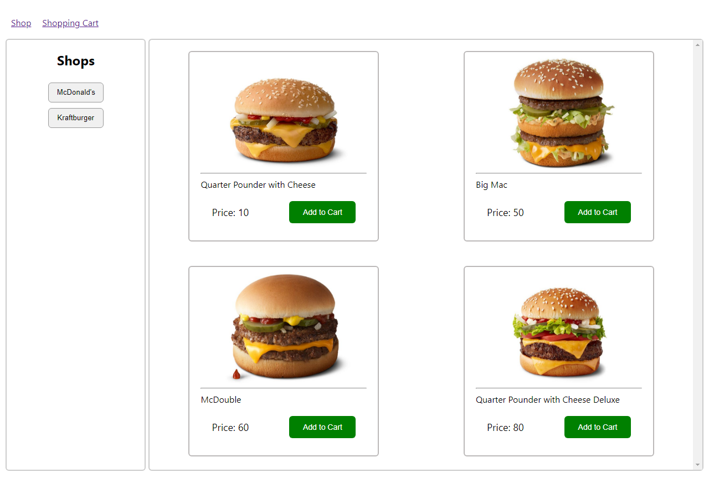
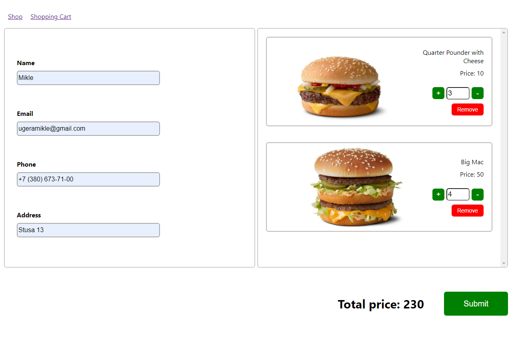
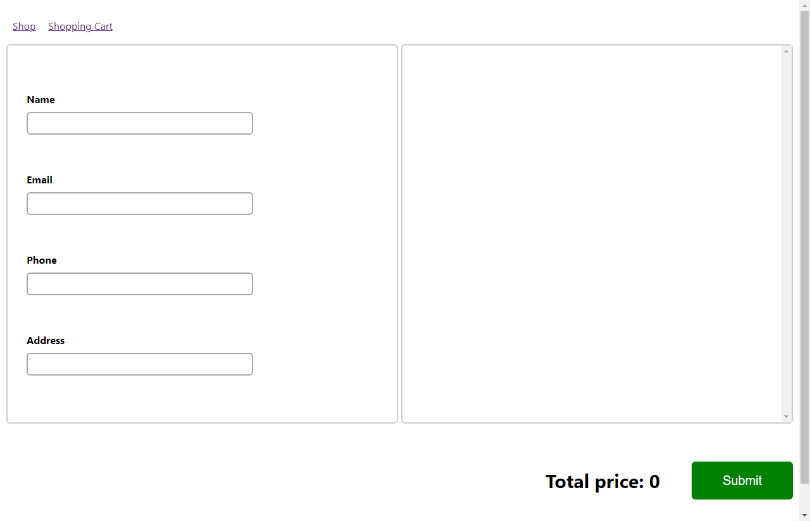

# Доставка їжі


# Опис

* можливість вибрати магазин з товаром
* можливість добавити товар у кошик
* можливість декілька разів добавляти той самий товар
* перейшовши в кошик маєм можливість додати кількість чи відняти
* менше одної кількості дозволяє нам видалити товар з кошика
* також можна видалити товар за допомогою кнопки remove
* при замовленні всі товари видаляються

# Демо

[LIVE](https://app-delivery-test.herokuapp.com)

вибираємо товар


вибираємо кільсть і вводимо особисті дані


натискаємо Submit


# Технології в проєкті

axios, react, redux, nodejs, sqlite

# Запуск

Перед запуском потрібно встановити npm і nodejs

Зробіть клон проєкту
```
git clone https://github.com/mikleugera/delivery-app-source-code.git 
```

У цьому ж каталозі виконайте наступні команди:
```
$ npm install
$ npm server
$ npm start
```


