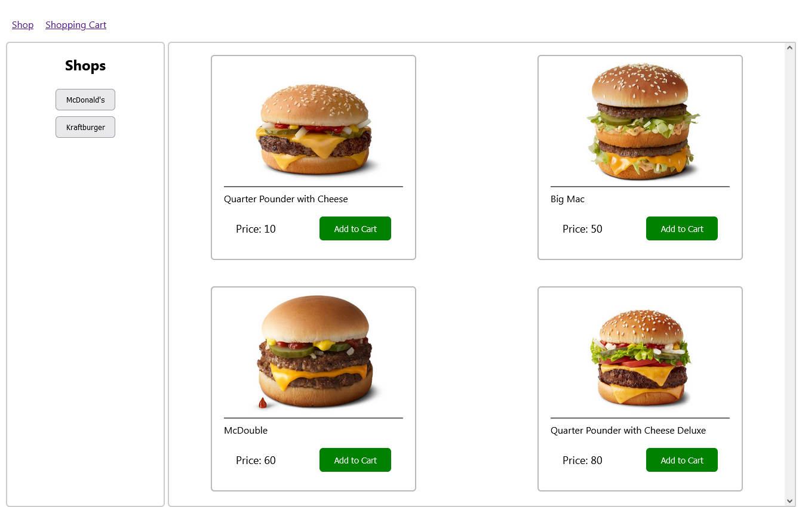

# Доставка їжі



# Опис

* можливість вибрати магазин з товаром
* можливість добавити товар у кошик
* можливість декілька разів добавляти той самий товар
* перейшовши в кошик маєм можливість додати кількість чи відняти
* менше одної кількості дозволяє нам видалити товар з кошика
* також можна видалити товар за допомогою кнопки remove
* при замовленні всі товари видаляються

# Демо

# технології в проєкті

axios, react, redux, nodejs, sqlite

# запуск

Зробіть клон проєкту


```
git clone 
```

У цьому ж каталозі інсталюй виконайте наступні команди:

```
$ npm install
$ npm start
```


